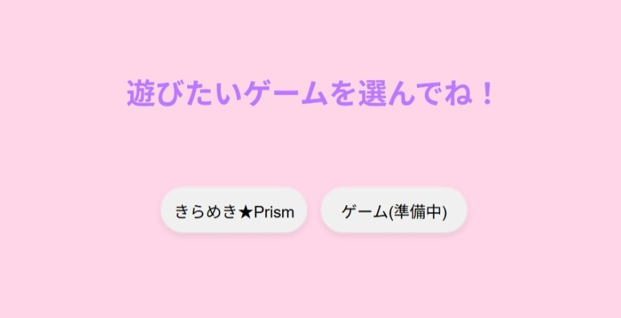
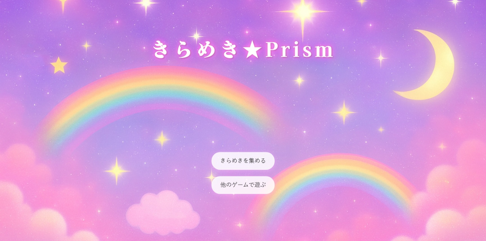
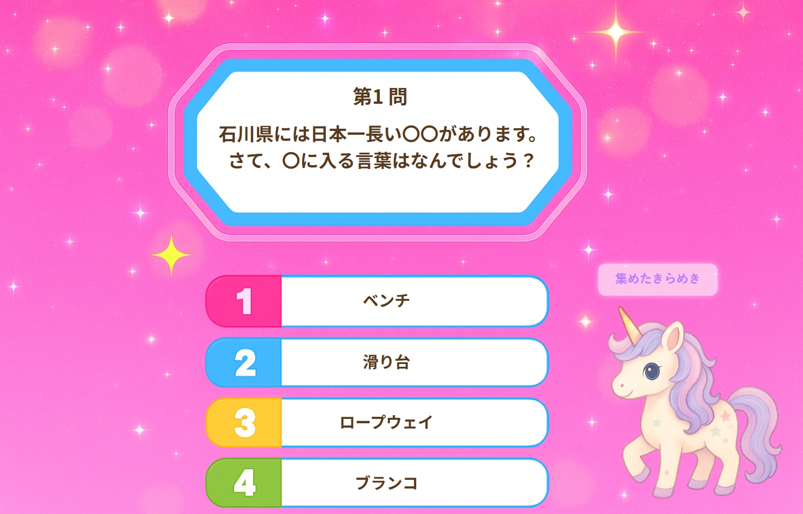
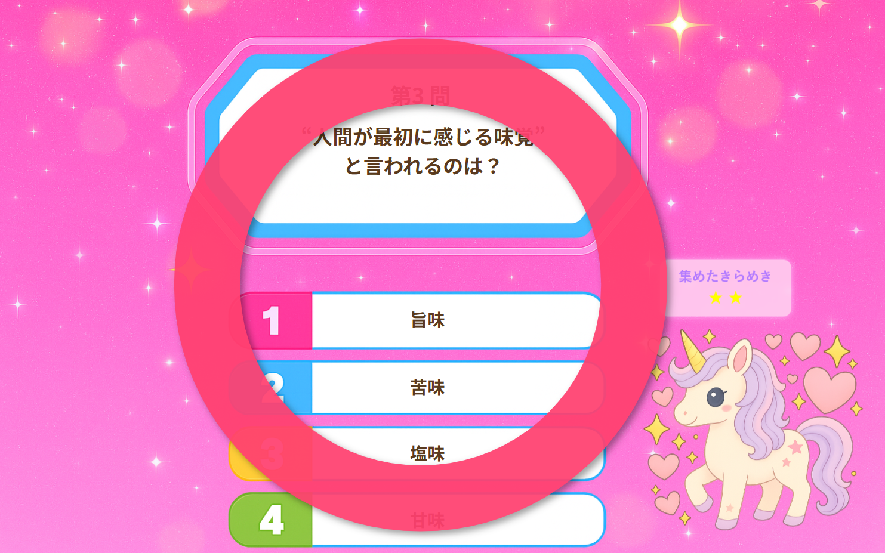
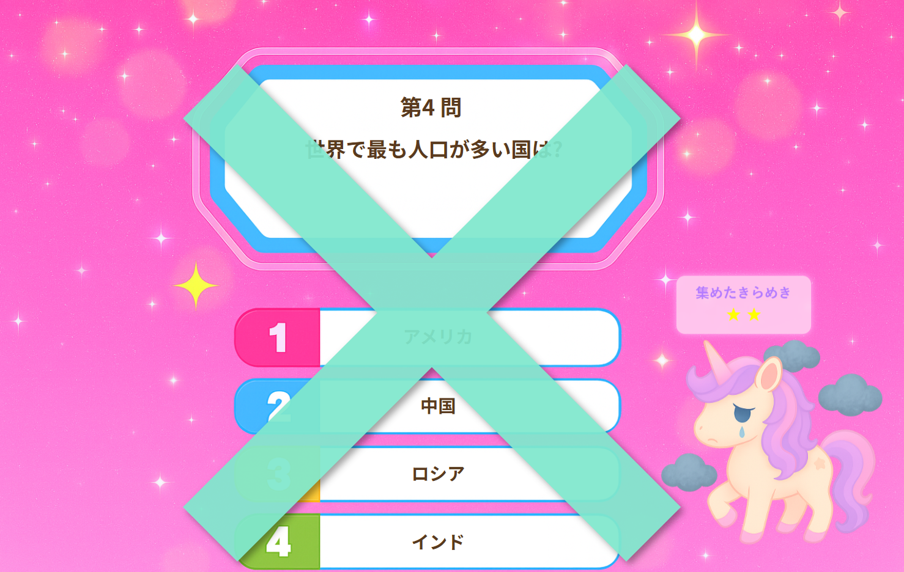
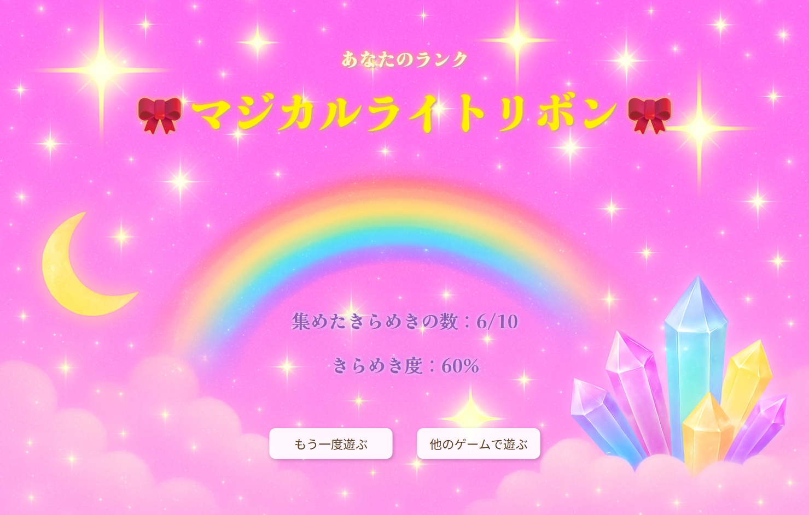

# quiz-servlet-jsp概要
Java Servlet / JSP を使用して作成したクイズアプリです。   卒業制作でチームで作ったゲーム集の中から、 ポートフォリオ用に自分が担当したクイズゲーム部分を独立させ、   新しいプロジェクトとして作り直しました。   Webアプリとして動作するように、index ページとindexへの遷移用サーブレットを新規に作成し 単体で遊べる形に調整しました。  
# 開発背景
チーム制作版では、ログイン機能やデータベース連携を含む構成になっており、  
複数人で役割分担をして開発を行っていました。  
また、他メンバーが担当したゲームも含まれていたため、  
自分が担当した範囲が分かりづらいと感じました。  
そのため、ポートフォリオ用に担当したクイズゲーム部分のみを切り出し、  
別プロジェクトとして再構築しています。
  
単体のクイズアプリとして動かすこともできましたが、  
元のゲーム集の構成を意識し、遊びたいゲームを選んで遷移できる形にするため、  
本プロジェクトでは新たに **index ページ / GameSelectServlet /「ゲーム作成中」ページ**  
を作成しています。  

## 開発環境
```
- Java
- Servlet / JSP
- HTML / CSS
- Apache Tomcat
- Eclipse（IDE）
```
## ディレクトリ構成  
```
game_quiz
 ├── src/main/java
 │    ├── servlet/
 │    │    ├── GameSelectServlet.java (★新規：メニュー画面への遷移用)
 │    │    └── QuizServlet.java       (クイズ進行管理用)
 │    └── model/
 │         ├── Question.java　 
 │         └── Question_Collection.java　　
 └── src/main/webapp
      ├── index.jsp	 	  (★新規：ゲーム選択画面)
      ├── css/style.css
      ├── images
      │　　　├── quiz	 	  (AI生成画像)
      │　　　└── readme		  (★README用画像)
      └── WEB-INF/jsp/
           ├── quizTop.jsp     (クイズのトップ画面)
           ├── quiz.jsp        (クイズ回答画面)
           ├── ok.jsp        　(正解画面)
           ├── no.jsp        　(不正解画面)
           ├── quizResult.jsp  (最終結果表示画面)
           └── game.jsp        (★新規：作成中ページ)
```

### デモ画面

#### 左：ゲーム選択画面 (index.jsp) ／ 右：ゲーム(準備中)画面 (gameA.jsp)


#### 左：クイズトップ画面 (quiztop.jsp) ／ 右：クイズ回答画面 (quiz.jsp)


#### 左：クイズ正解画面 (ok.jsp) ／ 右：クイズ不正解画面 (no.jsp)


#### 結果画面 (quizResult.jsp)
